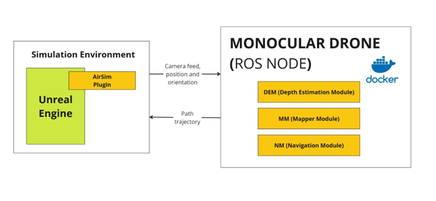
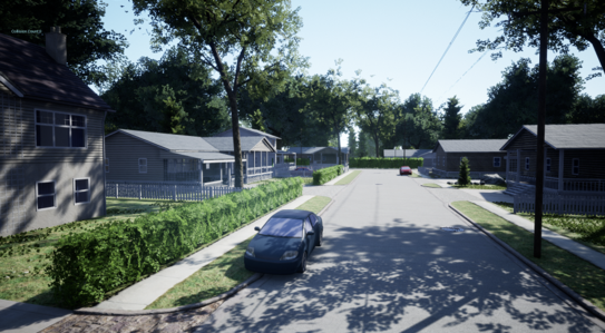
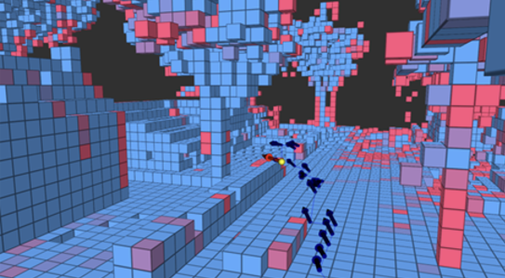

# A Framework for Autonomous UAV Navigation Based on Monocular Depth Estimation  
**ROS-Noetic monocular-SLAM with A\* path-planner for autonomous UAVs in unknown 3D environments**

[](https://github.com/jonasctrl/monocular-slam-drone/stargazers)
[](https://github.com/jonasctrl/monocular-slam-drone/network/members)
[](LICENSE)
[](https://github.com/jonasctrl/monocular-slam-drone/releases)
[](https://doi.org/10.3390/drones9040236)

> **Snapshot:** see **[v1.0.0](https://github.com/jonasctrl/monocular-slam-drone/releases/tag/v1.0.0)** for the exact code and assets used in the MDPI paper.

<!-- TOC depthFrom:2 depthTo:3 withLinks:1 updateOnSave:1 orderedList:0 -->

## About the Project
This open-source framework performs real-time **monocular depth estimation**, builds a 3D voxel occupancy grid, and runs an **A*** path-planning algorithm so a drone can reach goals while avoiding obstacles. All development and benchmarking occur in **AirSim** (Unreal Engine).

<p align="center">
  
</p>

> **Note** – The current implementation is a proof-of-concept; please refer to the paper for real-world considerations.

## Citation
When using A Framework for Autonomous UAV Navigation Based on Monocular Depth Estimation, please cite the following journal paper ([pdf](https://www.mdpi.com/2504-446X/9/4/236/pdf), [website](https://www.mdpi.com/2504-446X/9/4/236))

```bibtex
@article{monocular-slam-drone,
  title={A Framework for Autonomous UAV Navigation Based on Monocular Depth Estimation},
  author={Gaigalas Jonas and Perkauskas Linas and Gricius Henrikas and Kanapickas Tomas and Kriščiūnas Andrius},
  journal={Drones},
  year={2025},
  publisher={MDPI},
}
````

## Prerequisites

- Docker installed (with docker-compose support)
- _(optional)_ NVIDIA GPU and drivers with CUDA support for GPU acceleration 
- _(optional)_ X11 server running for displaying graphical applications 

> [!tip]
> If using Windows, you can set up `VcXsrv` as your X11 server. Instructions are provided in the "Setting Up X11 Server" section below.

## Project Setup Steps

Follow the steps below to set up the project on your local machine:

### 1. Clone Repository

Clone repository with included git submodules by running:

```bash
git clone --recurse-submodules https://github.com/jonasctrl/monocular-slam-drone.git
```

### 2. Build Docker Container

To build the project using docker compose:

```bash
docker compose up --build
```

### 3. Configure Environment

> [!caution]
> You need to create a `.env` file in the root directory and update it with your system-specific variables for display forwarding.

```bash
DISPLAY=192.168.0.120:0 # Your X11 server address
```

> [!tip]
> See `.env.example` for general steps on how to find your display for X11 forwarding.

### 4. Import Fine-tuned Models

Select the environment you want to use and import the fine-tuned model for it:

- Fine-tuned models are located in [Google Drive](https://drive.google.com/drive/folders/1gltcgQN3v4rantBJoUvqbjOjwxZHS9f1?usp=sharing)
- Models are trained on the [Model Datasets](https://ktuedu-my.sharepoint.com/:f:/g/personal/inglagz_ktu_lt/EtqAXut9CBtEgt6E24aQw7IBuQFxnNmzaBhxITkXozNysg?e=ahmvMk)

### 5. Start Simulation Environment

Start the simulation environment in Unreal Engine. The environment can be downloaded from the [AirSim Environments](https://github.com/microsoft/airsim/releases) page.

### 6. Configure AirSim

After starting the simulation environment:

1. AirSim will create configuration files in `C:\Users\{username}\Documents\AirSim\`
2. Copy the `settings.json` from the repository's config folder to the AirSim config directory

### 7. Launch the System

To start the project, run the following command inside the docker container:

```bash
python3 /catkin_ws/src/drone-node/src/mapper_nav_ros.py
```

> [!tip]
> The red grid shown in Rviz is the uncertain depth space and the blue one is the occupied-known space. Use the RVIZ window GUI to plan specified missions with the 2D planning tool.

## Architecture

The proposed architecture for an autonomous monocular drone navigation system is depicted in following diagram:



The system is divided into:

- **Simulation Environment**: Using `Airsim v1.8.1`
- **Monocular Drone Navigation System**: Running in a containerized Docker environment with `Ubuntu 20.04` and using the `ROS noetic v1.17.0` framework for communication

The navigation system consists of three modules:

<!-- toc:start -->

| Module                            | Description                                                                                                                                                |
| --------------------------------- | ---------------------------------------------------------------------------------------------------------------------------------------------------------- |
| **Depth Estimation Module (DEM)** | Estimates depth images from the RGB camera feed provided by the simulation environment. Based on "Depth Anything V2" model.                                |
| **Mapper Module (MM)**            | Builds and iteratively updates the occupancy map-based 3D environment using depth images from DEM and camera position/orientation from the simulation.     |
| **Navigation Module (NM)**        | Finds viable path trajectories to specified points in the mapped 3D environment using the A\* algorithm. Output is fed back to the simulation environment. |

<!-- toc:end -->

## Depth Mapping in 3D Space

The following images demonstrate the depth estimation and mapping process:

| Camera Image | 3D Mapping Visualization |
| :---: | :---: |
|  |  |

> [!tip]
> The red voxel grid shown in Rviz is the uncertain depth space and the blue one is the occupied-known space.

## Setting Up X11 Server for Display Forwarding

### Windows

If you're running this on Windows, you can set up an X11 server using `VcXsrv`:

1. Download and install [VcXsrv from SourceForge](https://sourceforge.net/projects/vcxsrv/)
2. During configuration, check the box "Disable access control"
3. Ensure that `DISPLAY` is correctly set in your `.env` file

### Linux

If using a Linux-based environment:

```bash
export DISPLAY=host.docker.internal:0
xhost +
```

> [!tip]
> To test the X11 setup, run `xclock` inside the container. If you see a clock window appear, your X11 server is configured correctly.

## License

Distributed under the **BSD 3-Clause License** – see [`LICENSE`](./LICENSE).
